<p align="center">
  
</p>

<p align="center">
  <a href="https://github.com/rjviernes620">
    
  </a>
</p>

<p align="center">
  <a href="https://rjviernes.tech" target="_blank">
    
  </a>
  <a href="https://linkedin.com/in/roel-junior-alejo-viernes-bab8a7253" target="_blank">
    
  </a>
  <a href="mailto:roel@rjviernes.tech" target="_blank">
    
  </a>
</p>

---

### 🪐 About Me

```bash
$ npx roel-junior --quote
"I code things which look cool and automate tasks I'm too lazy to do in real life." ⚙️✨
```

- 🧑💻 **Who I am**: Full-stack developer & tooling enthusiast who loves creating slick UIs and building custom automations.
- 📆 **Active since**: July 2018.
- ⚙️ **Currently working on**: [juicegels_v2](https://github.com/rjviernes620/juicegels_v2) (TypeScript).
- 📚 **Learning**: Deeper TypeScript architectures, advanced web tooling, and performance optimization.
- 🤝 **Collaboration**: Always down to collaborate on tooling, custom dashboards, or web automation.

---

### 🛠️ Skills & Technologies

I specialize in building modular web apps and automation workflows using the following stack:

<table width="100%">
  <tr>
    <td width="33%" valign="top">
      <h4>💻 Languages</h4>
      <a href="https://skillicons.dev"></a>
    </td>
    <td width="33%" valign="top">
      <h4>🌐 Frontend</h4>
      <a href="https://skillicons.dev"></a>
    </td>
    <td width="33%" valign="top">
      <h4>⚙️ Backend &amp; Tooling</h4>
      <a href="https://skillicons.dev"></a>
    </td>
  </tr>
</table>

---

### 🚀 Highlighted Projects

Below are some of my primary projects. Click on the project name to view the repository:

| Project | Primary Stack | Description |
| :--- | :--- | :--- |
| 🔧 **[juicegels_v2](https://github.com/rjviernes620/juicegels_v2)** |  | Major active project under development. Focuses on full-stack web and advanced tooling. |
| 🌐 **[web](https://github.com/rjviernes620/web)** |  | Front-end web application deployed and running on GitHub Pages. |
| 📊 **[SM-Dashboard](https://github.com/rjviernes620/SM-Dashboard)** |  | Web-based analytics/monitoring dashboard built for clean data visualization. |
| 💼 **[portfolio](https://github.com/rjviernes620/portfolio)** |   | Personal portfolio site presenting coding works and projects. |
| 📄 **[Roel CV](https://github.com/rjviernes620/Roel_Junior_Alejo_Viernes___CV)** |  | Clean, reproducible CV / résumé template formatted in LaTeX. |

---

### 📊 Developer Dashboard

<div align="center">
  <table border="0" cellpadding="0" cellspacing="0">
    <tr>
      <td valign="top" align="center">
        
      </td>
      <td valign="top" align="center">
        
      </td>
    </tr>
    <tr>
      <td colspan="2" align="center" valign="top">
        <br />
        
      </td>
    </tr>
  </table>
</div>

---

### 🔄 Live Activity Feed

<p align="left">
  
</p>

<!--START_SECTION:activity-->
*Waiting for the GitHub Action to populate recent activities...*
<!--END_SECTION:activity-->

---

<p align="center">
  <sub>Designed with ❤️ to match rjviernes.tech by Roel-Junior Viernes. Let's build something awesome!</sub>
</p>
